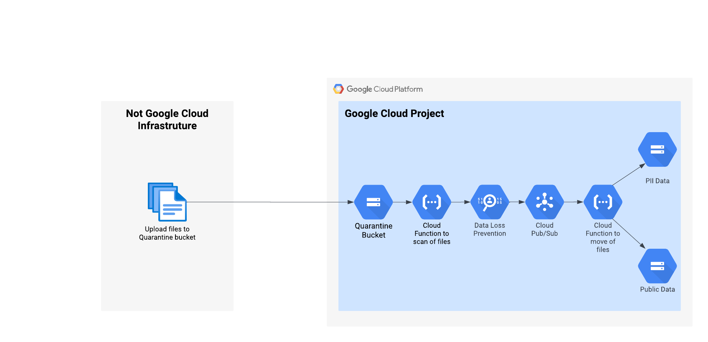

# terraform-google-dataloss-prevention

### Detailed
This module will deploy the infrastructure to automate the classification of data uploaded to Cloud Storage bucket.

The resources/services/activations/deletions that this module will create/trigger are:

- Creates a new Google Cloud project
- Creates a custom Service Account for the Cloud Functions
- Creates four storage buckets
- Create a pub/sub topic and subscription
- Creates two Cloud Functions

### PreDeploy
To deploy this module you must have an active billing account and billing permissions to deploy the project.

## Architecture


## Documentation
- [Original DLP Solution](https://codelabs.developers.google.com/codelabs/cloud-storage-dlp-functions#0)

## Usage

1. Clone repo
```
git clone https://github.com/jasonbisson/terraform-google-dataloss-prevention.git
cd ~/terraform-google-dataloss-prevention/
```

2. Rename and update required variables in terraform.tvfars.template
```
mv terraform.tfvars.template terraform.tfvars
#Update required variables
```
3. Execute Terraform commands with existing identity (human or service account) to build Infrastructure
```
terraform init
terraform plan
terraform apply
#Copy output of quarantine bucket 
quarantine_bucket= "dlp-quarantine-<random id>"
```
4. Upload the files to Quartine bucket
```
export quarantine_bucket= "dlp-quarantine-<random id>"
gcloud storage cp ./sample_data/* gs://${quarantine_bucket}
```
5. Review Cloud Logging & Buckets to ensure processing completed

<!-- BEGINNING OF PRE-COMMIT-TERRAFORM DOCS HOOK -->
## Inputs

| Name | Description | Type | Default | Required |
|------|-------------|------|---------|:--------:|
| billing\_account | The billing account id associated with the project, e.g. XXXXXX-YYYYYY-ZZZZZZ | `string` | n/a | yes |
| environment | Environment tag to help identify the entire deployment | `string` | `"dlp"` | no |
| folder\_id | The folder to deploy project in | `string` | n/a | yes |
| org\_id | The numeric organization id | `string` | n/a | yes |
| project\_name | Prefix of Google Project name | `string` | `"prj"` | no |
| pubsub\_entry\_point | Cloud Function to process pub sub events | `string` | `"resolve_DLP"` | no |
| region | Google Cloud region to deploy resources | `string` | `"us-central1"` | no |
| runtime | Cloud Function runtime | `string` | `"python310"` | no |
| storage\_entry\_point | Cloud Function to process storage events | `string` | `"create_DLP_job"` | no |

## Outputs

| Name | Description |
|------|-------------|
| quarantine\_bucket | Quarantine bucket |

<!-- END OF PRE-COMMIT-TERRAFORM DOCS HOOK -->

## Requirements

These sections describe requirements for using this module.

### Software

The following dependencies must be available:

- [Terraform][terraform] v0.13
- [Terraform Provider for GCP][terraform-provider-gcp] plugin v3.0

### Service Account

A service account with the following roles must be used to provision
the resources of this module:

- Project Creator 
- Project Deleter
- Billing User

The [Project Factory module][project-factory-module] and the
[IAM module][iam-module] may be used in combination to provision a
service account with the necessary roles applied.

### APIs

A project with the following APIs enabled must be used to host the
resources of this module:

- Cloud Function: `cloudfunctions.googleapis.com`
- Data Loss: `dlp.googleapis.com`
- Cloud Build: `cloudbuild.googleapis.com`
- Cloud Resource: `cloudresourcemanager.googleapis.com`
- Artifact Registry: `artifactregistry.googleapis.com`
- Pub Sub: `pubsub.googleapis.com`

The [Project Factory module][project-factory-module] can be used to
provision a project with the necessary APIs enabled.

## Contributing

Refer to the [contribution guidelines](./CONTRIBUTING.md) for
information on contributing to this module.

[project-factory-module]: https://registry.terraform.io/modules/terraform-google-modules/project-factory/google
[terraform-provider-gcp]: https://www.terraform.io/docs/providers/google/index.html
[terraform]: https://www.terraform.io/downloads.html

## Security Disclosures

Please see our [security disclosure process](./SECURITY.md).
